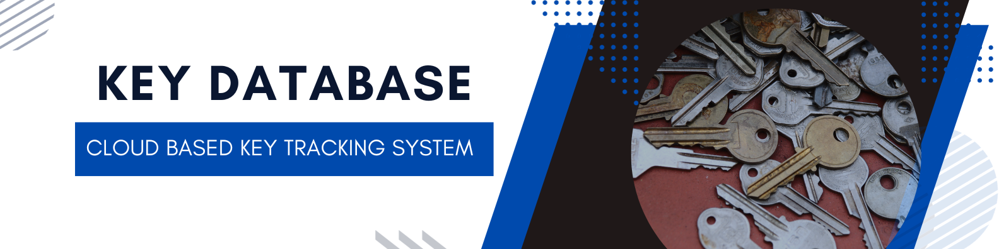
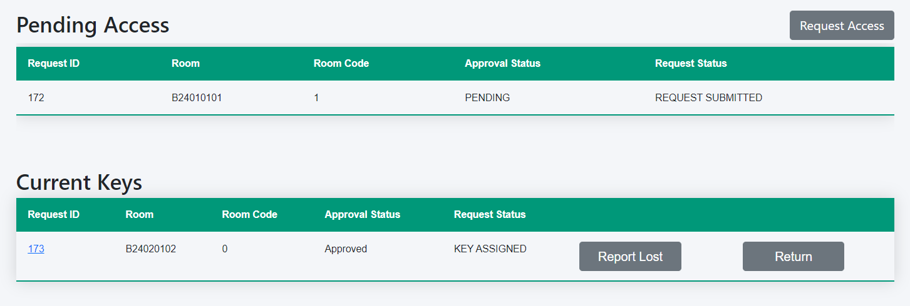
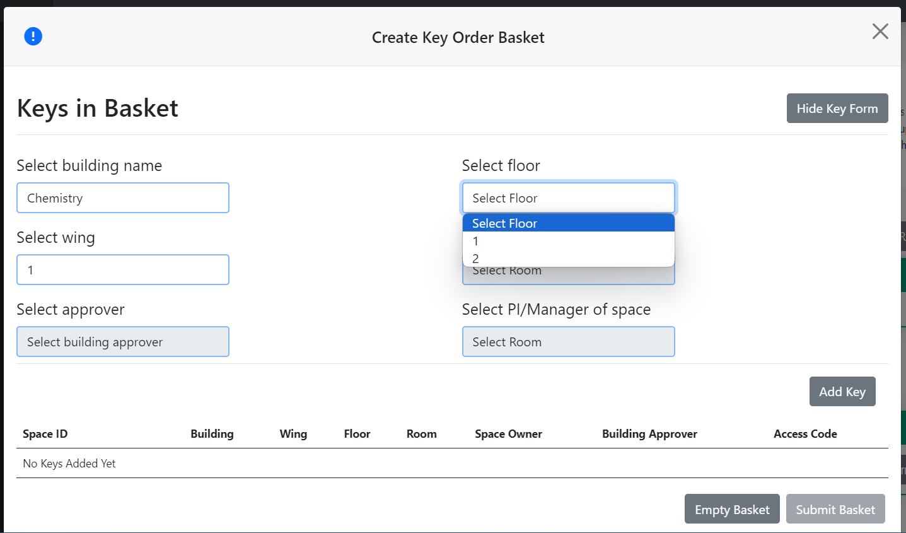
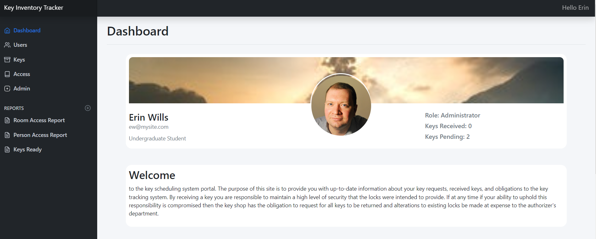
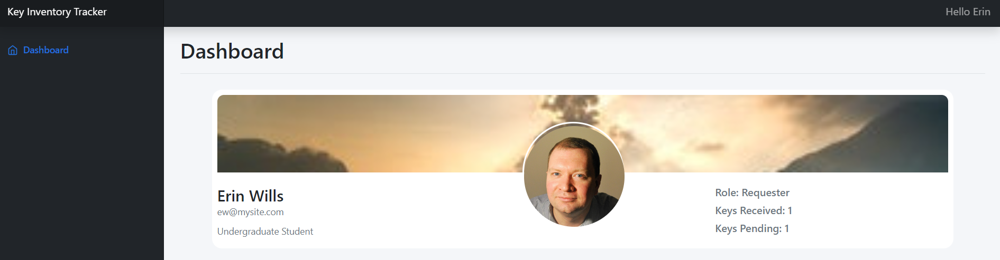
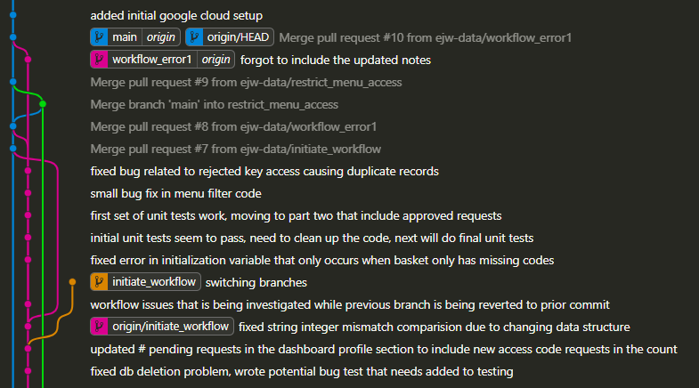
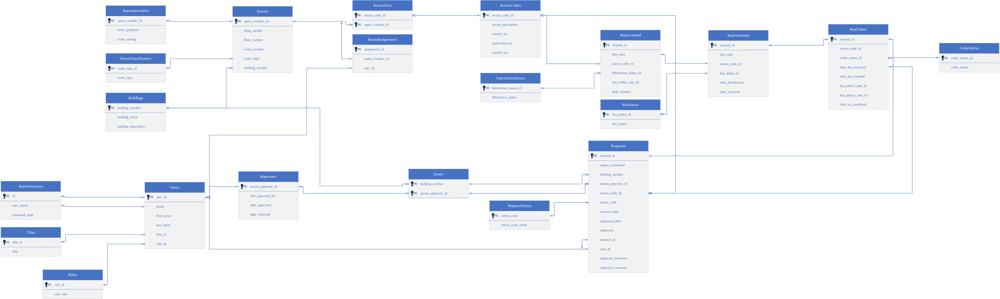
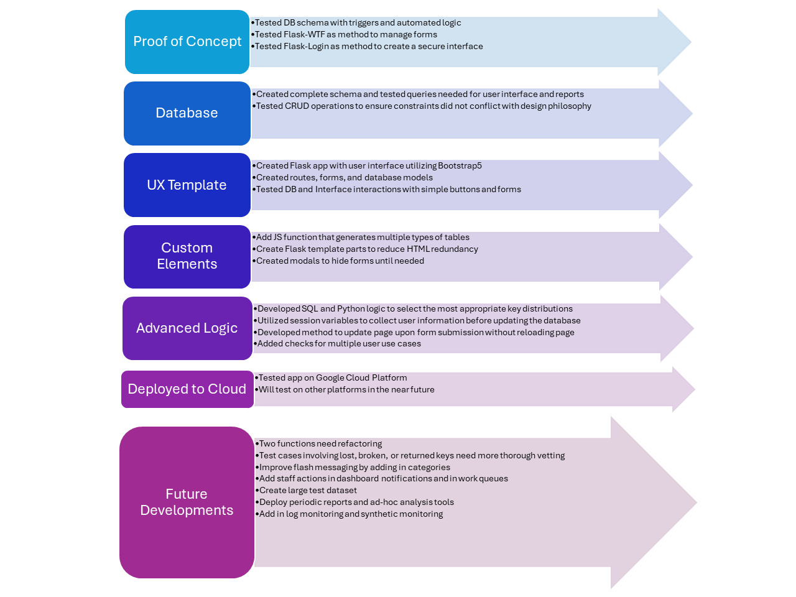
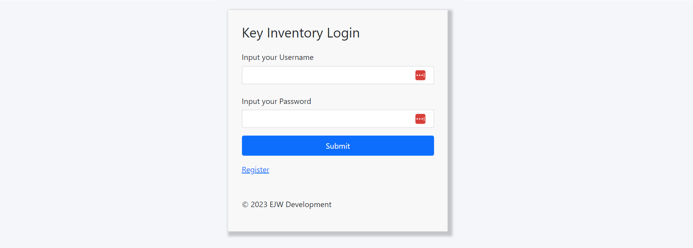

# proj-key-inventory

Author:  Erin James Wills, ejw.data@gmail.com



<cite>Photo by <a href="https://unsplash.com/@contradirony?utm_content=creditCopyText&utm_medium=referral&utm_source=unsplash">Samantha Lam</a> on <a href="https://unsplash.com/photos/silver-and-gold-round-coins-zFy6fOPZEu0?utm_content=creditCopyText&utm_medium=referral&utm_source=unsplash">Unsplash</a>
  </cite>


```txt
Status:  This is an ongoing project with a scope that keeps evolving. Most of this work was done in late November through the end of December.  I have a handful more tasks to complete so that the program will be a full scale software tool that could manage all phases of of key inventory system, but I have some other priorities right now so I will be taking a break from this project to work on analytics projects for January, February, and maybe March.  
```


## Objective
> Create a cloud-based space management system that will automate traditional keys systems found at universities.  Often universities use a decentralized system for managing key and key card access.  Relying on a decentralized system often creates several issues such as:
    - building managers must approve all keys and maintain their own system of tracking users leading to issues when buiding managers leave or do not have time to create a quality record system
    - records are often duplicated between key shop/billing, building managers, and the manager of the space leading to inconsistencies and gaps in information
    - each building will often have different standards for documenting, disbursing, and collecting the keys
    - assessing the quality of the system can become very difficult as individual steps are not clearly demarcated  

## Summary  
This system is a self-serve web portal that allows building managers to add new people to the system by only knowing their email address.  The user can then complete the registration process and then can request access to one or multiple spaces.  The building manager will then be notified in their dashboard view of the request that they can approve or reject or message the user for information.  The manager may want to verify information from the user's profile with their records to ensure consistency with other systems like safety systems.  Upon approval, the request is then sent to the fabrication shop or key administration ofice depending on whether the key needs made or is available in inventory.  Each stage of the process, has updates so the user requesting the key can see the progress from 'Key Requested', 'Key Approved', 'Key being Fabricated', 'Key Available, Waiting for Delivery', and 'Key Ready for Pickup'.  

```text
Originally this project was only going to be a simple CRUD program with an html interface.  The inspiration was to recreate a project I did several years ago that standardized and automated a time consuming work task.  I started scoping the project in November and did most of the complicated design work during the weeks I had off around Thanksgiving and Christmas. 
```


## Current Features
- User Access
    *  Login page that hashes passwords in the database
    *  Only administrators can add users but upon first login the user must generate their own password
    *  Header shows logged in user and has options for logging out and changing users.  

- App Security
    *  Flask app manages security of form submissions, form validation, cookies, and access  
    *  Webpages are protected to be viewed by only logged in users and further restrictions based on user role have been placed on pages and apis.

- App Scaleability
    *  Database designed with PostgreSQL and normalized (1N, 2N, and 3N)
    *  Complicated manipulations created in PL/pgSQL
    *  Database triggers used to automate tasks 
    *  Multistep workflow built into table design
    *  SQLAlchemy was used to manage queries using ORM Table methods (instead of session methods)
    *  Standard SQL was used in query that finds unique access codes - wrote query to accept varying size inputs

- App Modularity
    *  HTML tables are generated from javascript (d3.js) and APIs.
    *  Order basket updates without page reloads and utilizes API that loads updated HTML for only a section of the page
    *  Site pages and API routes are separated into separate files
    *  Site templates and layouts applied
    *  Custom jinja filters created to add python functionality and make code more readable
    *  App split into multiple files for ease of tracking and updating
    *  Created standardized HTML page layouts, styles using bootstrap5  
    
    Tables dynamically generated with interactive features  
    <br>

- User Interface - Custom Order Process
    *  Complete shopping basket created with flask routes and D3.js
    *  Order basket entries stored in session variables 
    *  Order menus show all options if javascript is deactivated but when active the menu's filter to show only possible selections based on prior selections.
    *  Order basket determines optimum selection of ordered items to show fewest dispersements - checks inventory of available keys, checks if key needs fabricated, checks to see if key needs added to system, checks to see if keys need returned  
    
    Popup modals that dynamically update without page reloads, dropdowns populate based on current form inputs   
    <br>

- Staff Interface - Custom Views by Role
    * Dashboard, Admin, Key Shop, Building Manager
    * To make HTML interface code more concise, created custom jinja templates  
    
    Admin View  
    <br>
    
    Key Requester View  
    <br>
    
- App Development Processes
    *  Used venv as a simple virtual environment
    *  Developed application using git and task-based git branches
    *  Data governance by restricting data access
    *  Separated app into purpose-based files
    *  Applied Object Oriented design such that SQLAlchemy ORM and Flask extensions could be added in the future  
    *  Utilized git branches to resolve bugs and add features
      
    Git Activity

- Database Configuration Files
    *  Database schema, data, and pgSQL procedures were implemented as basic SQL files.  A more advanced version of the template dabase might be needed in the future.  
    *  pgAdmin access to local and cloud instances
    *  Detailed Entity Relationship Diagram (ERD) used during initial scoping and development of new features
      
    Database Entity Relationship Diagram (ERD)

- Highly Structured Repository
    *  Flask template routes and Flask API data routes were separated into separate files using Blueprint methods
    *  Route access constraints were added using python decorators
    *  SQLAlchemy was used for database modeling and table objects contained in one file
    *  Flask template parts are used for repeated HTML sections
    *  Flask templates and Javascript are used to update page elements without reloading the page
    *  HTML tables are dynamically created using D3.js 
    *  Custom Jinja functions were used to increase the readability in the HTML
    *  Queries are largely separated into their own file
    *  Queries are written with SQLAlchemy Table methods instead of session methods to improve readability
    *  String-based SQL queries were used minimally, contained in their own file, and applied where other methods would be more complicated.
    *  WTForms is used to generate forms, validate inputs, and improve security in an objected oriented method
    *  PostgreSQL triggers and procedures are used to automate database operations with minimal python.
    *  SQL schema and simple data insertion files were created to easly generate test databases on multiple platforms

    > To learn about future development goals, read this [article](./docs/features.md)

## App Value
The direct value of this app would be assessed by the time savings gained by the implementing institution but would also have indirect value by:  
*  increasing data availability and consistency 
*  institutionalizing policies across all units 
*  improving user experience 
*  defining and enforcing role responsibilities 
*  disbursing improvements across all units at a fraction of the individual unit investment
*  providing intuitive use such that cross-functional staff training can be implemented to reduce single source of authority 
    - aka increasing availability of approvers even if on vacation, travel, re-assignment, or unfilled position  

In a year, a building manager of a large facility might have a little over 35 hours allocated to key management (receiving requests, documenting, summary reports, etc).  This could total nearly $1,700 invested in this activity.  For a large institution that has 40 building manager then this would result in more than $65,000 spent on this activity.  

> For a more detailed analysis, see this [article](./docs/value.md).

## Cost of Deployment  
Deploying on AWS Cloud with redundant PostgreSQL servers would cost approximately $400 annually.  Deploying everything on GCP App Engine would cost about $700 annually.  

## Data
All data used for this application was synthetically created and based on a theoretical scenario  

## Collaborators  
Currently there are no collaborators and advanced features will probably not be made available due to the potential for this app to be commercially distributed.  Please contact repo owner to request collaboration interest or access to the full source code and installation instructions.  

## Workflow  



## Technologies
*  Python
    - Flask
    - SQLAlchemy
*  Javascript
*  PostgreSQL
*  HTML/CSS


## Setup

### Create Environment
* `python -m venv <name_of_virtualenv>`

### Installs
* `pip install Flask`
* `pip install -U Flask-SQLAlchemy`
* `pip install sqlalchemy-utils`
* `pip install werkzeug`
* `pip install flask-WTF`
* `pip install psycopg2`
* `pip install flask_login`
* `pip install pandas`
* `pip install numpy`
* `pip install Jinja2`
* `pip install gunicorn`
* `pip install pg8000`

* may need the `pip install ipykernel` - this is really only needed for interactive window in VSCode 

### Activate Environment
* `. venv/Scripts/activate`


### Selection of Local Database or Cloud Database
*  Update ENV variable on:
    *  query.py
    *  setup.py
    *  app.py  


## Other App Images  

  
App Login page  
<br>

  
Logout modal
<br>

